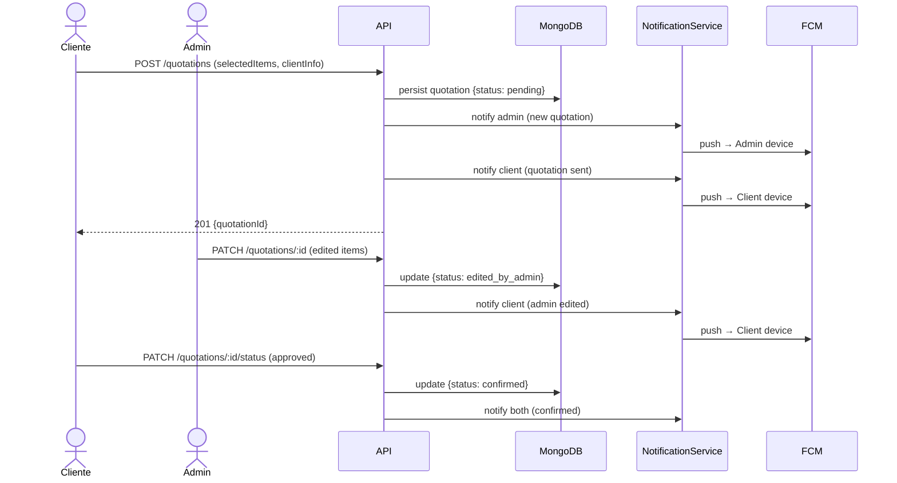
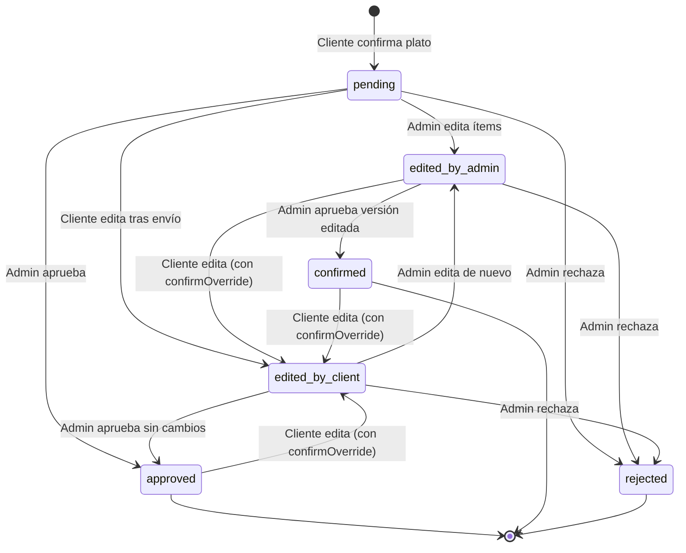

# Design Document — Menu Digital Platform

## Overview

Menu Digital es una plataforma de cotización de menús para eventos gastronómicos (AromaSabor). El sistema permite que un Admin (chef/caterer) publique menús digitales con categorías e ítems fotografiados, y que el Cliente final acceda por link o QR, arme su plato visualmente con animación ítem a ítem, y reciba una cotización automática en tiempo real.

El diferenciador central del producto es el **PlateBuilder visual**: el cliente ve su plato armándose de forma animada mientras selecciona porciones por categoría, creando una experiencia gastronómica única que ninguna plataforma de catering colombiana ofrece actualmente.

La plataforma soporta un **ciclo de vida de cotización con edición bilateral**: tanto el Cliente como el Admin pueden modificar los ítems del plato en cualquier momento después de confirmado, con notificaciones push automáticas en cada transición de estado. Las actualizaciones se reflejan en tiempo real vía Socket.IO en el panel del Admin.

### Alcance del Sistema

- **API REST** (NestJS): lógica de negocio, autenticación JWT, máquina de estados de cotización, Pricing Engine y despacho de notificaciones.
- **Web Admin** (Next.js 14 App Router): panel de gestión de menús, cotizaciones, historial de cambios y CRUD de ítems.
- **App Móvil** (React Native + Expo): flujo de armado de plato, confirmación, edición post-envío y recepción de notificaciones push.
- **Paquetes compartidos** (Turborepo): tipos TypeScript, Pricing Engine puro y plantillas de notificación.


---

## Architecture

### Visión General

El sistema utiliza una arquitectura de **monorepo con Turborepo** que aloja tres aplicaciones independientes y tres paquetes compartidos. La comunicación entre el cliente móvil/web y la API es principalmente REST, complementada con WebSockets (Socket.IO) para actualizaciones en tiempo real hacia el Admin.

```
┌─────────────────────────────────────────────────────────────────┐
│                        MONOREPO (Turborepo)                     │
│                                                                 │
│  ┌───────────────┐  ┌─────────────────┐  ┌──────────────────┐  │
│  │  apps/mobile  │  │  apps/web-admin │  │     apps/api     │  │
│  │  React Native │  │  Next.js 14 AR  │  │     NestJS       │  │
│  │  Expo         │  │  NextAuth.js    │  │  MongoDB Atlas   │  │
│  └───────┬───────┘  └────────┬────────┘  └────────┬─────────┘  │
│          │                   │                    │             │
│          └──────────REST / WebSocket──────────────┘             │
│                                                                 │
│  ┌──────────────────┐  ┌──────────┐  ┌─────────────────────┐   │
│  │  packages/       │  │  utils/  │  │  notification-      │   │
│  │  shared-types/   │  │  pricing │  │  templates/         │   │
│  └──────────────────┘  └──────────┘  └─────────────────────┘   │
└─────────────────────────────────────────────────────────────────┘
```

### Servicios Externos

| Servicio | Propósito | Integración |
|----------|-----------|-------------|
| MongoDB Atlas | Persistencia principal | Mongoose ODM |
| Cloudinary | Almacenamiento y transformación de imágenes | REST API + SDK |
| Firebase Cloud Messaging | Notificaciones push iOS/Android | Admin SDK (NestJS) |
| Resend | Email de fallback para notificaciones | REST API |

### Diagrama de Flujo de Cotización




### Máquina de Estados de Cotización



**Decisión de diseño:** El estado `approved` puede ser sobreescrito por `edited_by_client` si el Cliente incluye `confirmOverride: true` en el payload. Esto evita crear nuevas cotizaciones y mantiene el historial en un único documento. Las transiciones inválidas retornan HTTP 409.

---

## Components and Interfaces

### Backend — NestJS Modules

#### AuthModule

Responsable de emitir y validar JWTs para Admin y Cliente.

```typescript
// Interfaces clave
interface AdminLoginDto {
  email: string;       // formato email válido
  password: string;    // no vacío
}

interface ClientAccessDto {
  slug: string;        // 3-100 caracteres, alfanumérico con guiones
}

interface JwtAdminPayload {
  sub: string;         // adminId
  email: string;
  role: 'admin';
  iat: number;
  exp: number;         // 24h
}

interface JwtClientPayload {
  sub: string;         // clientId efímero (UUID)
  menuId: string;      // scope limitado al menú del evento
  role: 'client';
  iat: number;
  exp: number;         // 72h
}
```

Guards: `JwtAuthGuard` (valida firma y expiración), `RolesGuard` (verifica `role: 'admin'`), `ClientOwnerGuard` (verifica que el `menuId` del JWT coincida con la cotización).


#### MenuModule

```typescript
// DTOs principales
interface CreateMenuDto {
  name: string;               // ≤ 120 caracteres
  categories: CreateCategoryDto[];
}

interface CreateCategoryDto {
  id: string;
  label: string;
  maxItems: number;
  required?: boolean;
  items: CreateItemDto[];
}

interface CreateItemDto {
  name: string;
  portionGrams: number;       // > 0
  pricePerPortion: number;    // ≥ 0
  unit?: string;              // 'gr' | 'ml'
  imageUrl?: string;
}

interface UpdateItemDto {
  name?: string;
  portionGrams?: number;
  pricePerPortion?: number;
  isAvailable?: boolean;
  imageUrl?: string;
}
```

Endpoints:
| Método | Ruta | Guard | Descripción |
|--------|------|-------|-------------|
| GET | /menus | JwtAdmin | Listar menús del admin |
| POST | /menus | JwtAdmin | Crear menú |
| GET | /menus/:slug | Público | Ver menú activo (solo ítems disponibles) |
| PATCH | /menus/:id | JwtAdmin | Editar menú; regenera slug si cambia nombre |
| POST | /menus/:id/items | JwtAdmin | Agregar ítem a categoría |
| PATCH | /menus/:id/items/:itemId | JwtAdmin | Editar ítem |
| DELETE | /menus/:id/items/:itemId | JwtAdmin | Soft-delete: `isAvailable: false` |
| POST | /menus/:id/image | JwtAdmin | Upload imagen → Cloudinary (400×400 WebP) |

**Decisión de diseño:** El soft-delete de ítems (`isAvailable: false`) es obligatorio para preservar la integridad del historial en cotizaciones existentes que referencian ese `itemId`.

#### QuotationModule

```typescript
interface CreateQuotationDto {
  menuId: string;
  clientInfo: ClientInfoDto;
  selectedItems: SelectedItemDto[];
  numberOfPeople: number;      // [1, 10000]
  fcmToken?: string;
}

interface ClientInfoDto {
  name: string;
  phone: string;               // máx. 20 caracteres
  email: string;
  eventType: string;
  eventDate: string;           // ISO 8601
}

interface SelectedItemDto {
  categoryId: string;
  categoryLabel: string;
  itemId: string;
  itemName: string;
  portionGrams: number;
  pricePerPortion: number;     // snapshot en el momento de creación
}

interface EditQuotationDto {
  selectedItems: SelectedItemDto[];
  reason?: string;             // ≤ 255 caracteres
  confirmOverride?: boolean;   // requerido para editar approved/confirmed
}

interface UpdateQuotationStatusDto {
  status: 'approved' | 'confirmed' | 'rejected';
  adminNotes?: string;         // requerido si status = 'rejected'
}
```


#### NotificationModule

```typescript
interface NotificationPayload {
  recipientType: 'admin' | 'client';
  fcmToken?: string;
  email?: string;
  title: string;
  body: string;
  quotationId: string;
  type: NotificationEventType;
}

type NotificationEventType =
  | 'new_quotation'
  | 'client_edited'
  | 'client_confirmed'
  | 'admin_edited'
  | 'approved'
  | 'confirmed'
  | 'rejected';
```

Estrategia de entrega:
1. Si `fcmToken` presente → FCM push
2. Si FCM falla → retry exponencial (1s, 2s, 4s) × 3 intentos
3. Si agota reintentos → fallback email con Resend
4. Cada intento queda registrado en `notification_logs`

#### SocketGateway

Eventos emitidos a Admins conectados:
- `quotation:updated` — payload completo de la cotización tras cualquier modificación
- `quotation:editing` — `{quotationId}` cuando el Cliente abre modo edición
- `quotation:editing:stopped` — `{quotationId}` cuando el Cliente cierra la edición

Autenticación: JWT_Admin en el handshake (`auth.token`). Sin JWT válido → conexión rechazada con código 401.

### Frontend — Web Admin (Next.js 14)

Estructura de rutas App Router:

```
app/
├── (auth)/
│   └── login/page.tsx
├── (admin)/
│   ├── layout.tsx              # Protegido con NextAuth session
│   ├── dashboard/page.tsx      # Métricas + lista cotizaciones
│   ├── quotations/
│   │   ├── page.tsx            # Lista paginada con filtros
│   │   └── [id]/
│   │       ├── page.tsx        # Detalle + botones acción
│   │       ├── EditPlatePanel.tsx
│   │       ├── PlateComparison.tsx
│   │       └── QuotationTimeline.tsx
│   └── menus/
│       ├── page.tsx
│       └── [id]/page.tsx
```

Gestión de estado:
- **React Query**: fetch y cache de cotizaciones/menús, invalidación automática al recibir eventos Socket.IO
- **Zustand**: estado de edición del plato en el `EditPlatePanel`
- **NextAuth.js**: sesión del Admin (cookie HttpOnly)

### Frontend — Mobile App (React Native + Expo)

Pantallas principales:

```
screens/
├── SplashScreen.tsx
├── MenuScreen.tsx           # Carrusel de categorías
├── PlateBuilderScreen.tsx   # Selección + animación Reanimated 3
├── EditPlateScreen.tsx      # Edición post-confirmación
├── QuotationScreen.tsx      # Número personas + resumen + formulario
└── ConfirmationScreen.tsx   # Estado + detalle cotización
```

Hooks clave:
- `usePlateEditor`: gestión del estado local del plato (selección, reemplazo, cálculo)
- `useQuotation`: React Query para POST/PATCH de cotizaciones
- `useNotification`: FCM listener (foreground banner + deep link desde background)

Estado global (Zustand): `plate` (ítems seleccionados), `numberOfPeople`, `quotationId`


### Pricing Engine — Paquete Compartido

Función pura en `packages/utils/src/pricing.ts`, utilizada tanto en el frontend (cálculo en tiempo real) como en el backend (persistencia al crear/editar cotización).

```typescript
export interface SelectedItem {
  itemId: string;
  itemName: string;
  categoryLabel: string;
  pricePerPortion: number;
  portionGrams: number;
}

export interface QuotationResult {
  pricePerPlate: number;
  totalPrice: number;
  breakdown: { category: string; item: string; price: number }[];
}

export function calculateQuotation(
  selectedItems: SelectedItem[],
  numberOfPeople: number
): QuotationResult {
  if (numberOfPeople < 1 || numberOfPeople > 10_000) {
    throw new RangeError(`numberOfPeople must be between 1 and 10000, got ${numberOfPeople}`);
  }

  const breakdown = selectedItems.map(item => ({
    category: item.categoryLabel,
    item: item.itemName,
    price: item.pricePerPortion,
  }));

  // half-up rounding via toFixed(2) + parseFloat
  const rawPricePerPlate = selectedItems.reduce((sum, item) => sum + item.pricePerPortion, 0);
  const pricePerPlate = roundHalfUp(rawPricePerPlate);
  const totalPrice = roundHalfUp(pricePerPlate * numberOfPeople);

  return { pricePerPlate, totalPrice, breakdown };
}

function roundHalfUp(value: number): number {
  return parseFloat((Math.round(value * 100) / 100).toFixed(2));
}
```

**Decisión de diseño:** La función es pura (sin efectos secundarios) para facilitar el property-based testing. Los precios se redondean con `Math.round(x * 100) / 100` (half-up IEEE 754) para evitar drift de coma flotante. El rechazo de `numberOfPeople` fuera de rango es explícito y lanzable.

---

## Data Models

### Colección: `menus`

```typescript
interface MenuDocument {
  _id: ObjectId;
  name: string;                 // ≤ 120 caracteres
  slug: string;                 // único por admin, alfanumérico-guiones
  isActive: boolean;
  adminId: ObjectId;            // referencia al admin propietario
  categories: CategoryEmbedded[];
  createdAt: Date;
  updatedAt: Date;
}

interface CategoryEmbedded {
  id: string;                   // ej: 'proteinas'
  label: string;                // ej: 'Proteína'
  maxItems: number;
  required?: boolean;
  items: ItemEmbedded[];
}

interface ItemEmbedded {
  id: string;                   // ej: 'pechuga-plancha'
  name: string;
  imageUrl?: string;            // URL Cloudinary 400×400 WebP
  portionGrams: number;         // > 0
  pricePerPortion: number;      // ≥ 0
  unit: 'gr' | 'ml';
  isAvailable: boolean;         // false = soft-deleted
}
```

Índices:
- `{ slug: 1, adminId: 1 }` unique — garantiza unicidad de slug por admin
- `{ isActive: 1 }` — para búsquedas de menús públicos
- `{ adminId: 1, createdAt: -1 }` — para listados del admin


### Colección: `quotations`

```typescript
type QuotationStatus =
  | 'pending'
  | 'edited_by_admin'
  | 'edited_by_client'
  | 'approved'
  | 'confirmed'
  | 'rejected';

interface QuotationDocument {
  _id: ObjectId;
  menuId: ObjectId;
  adminId: ObjectId;
  clientInfo: ClientInfo;
  selectedItems: SelectedItemSnapshot[];  // snapshot de precios al momento de creación/edición
  numberOfPeople: number;                 // [1, 10000]
  pricePerPlate: number;                  // suma de pricePerPortion, 2 decimales half-up
  totalPrice: number;                     // pricePerPlate × numberOfPeople, 2 decimales half-up
  status: QuotationStatus;
  adminNotes: string | null;
  editHistory: EditHistoryEntry[];
  createdAt: Date;
  updatedAt: Date;
}

interface ClientInfo {
  name: string;
  phone: string;               // máx. 20 caracteres
  email: string;
  eventType: string;
  eventDate: string;           // ISO 8601
  fcmToken: string | null;     // null si cliente no tiene app instalada
}

interface SelectedItemSnapshot {
  categoryId: string;
  categoryLabel: string;
  itemId: string;
  itemName: string;
  portionGrams: number;
  pricePerPortion: number;     // SNAPSHOT: no se actualiza si el admin cambia el menú
}

interface EditHistoryEntry {
  editedBy: 'admin' | 'client';
  editedAt: Date;              // timestamp ISO 8601
  previousItems: SelectedItemSnapshot[];
  newItems: SelectedItemSnapshot[];
  reason: string | null;       // ≤ 255 caracteres, opcional
}
```

Índices:
- `{ adminId: 1, status: 1 }` — filtrado por estado en panel admin
- `{ adminId: 1, updatedAt: -1 }` — orden por modificación reciente (default)
- `{ adminId: 1, createdAt: -1, status: 1 }` — filtros de fecha + estado
- `{ 'clientInfo.email': 1 }` — búsqueda de cotizaciones por email del cliente

**Decisión de diseño:** Los `selectedItems` en una cotización son un snapshot inmutable de precios. Cuando el Admin modifica `pricePerPortion` de un ítem en el menú, las cotizaciones existentes NO se actualizan (Requirement 14.3). Esto garantiza aislamiento de precios.

### Colección: `notification_logs`

```typescript
interface NotificationLogDocument {
  _id: ObjectId;
  quotationId: ObjectId;
  recipientType: 'admin' | 'client';
  channel: 'push' | 'email';
  type: NotificationEventType;
  sentAt: Date;
  status: 'success' | 'failed';
  errorMessage?: string;
  attemptNumber: number;       // 1-4 (3 reintentos + intento inicial)
}
```

Índice: `{ quotationId: 1, sentAt: -1 }` — para historial de notificaciones por cotización.


---

## Correctness Properties

*A property is a characteristic or behavior that should hold true across all valid executions of a system — essentially, a formal statement about what the system should do. Properties serve as the bridge between human-readable specifications and machine-verifiable correctness guarantees.*

Las propiedades se derivan del análisis de criterios de aceptación marcados como PROPERTY en el prework. Se verifican mediante property-based testing usando **fast-check** (TypeScript), con mínimo 100 iteraciones por propiedad.

---

### Property 1: Cálculo correcto del Pricing Engine

*Para cualquier* array no vacío de `SelectedItem` con `pricePerPortion ≥ 0` y cualquier `numberOfPeople` en el rango `[1, 10000]`, `calculateQuotation` debe retornar `pricePerPlate` igual a la suma de todos los `pricePerPortion` redondeada a 2 decimales half-up, y `totalPrice` igual a `pricePerPlate × numberOfPeople` redondeado a 2 decimales half-up.

**Validates: Requirements 5.2, 5.3, 14.1, 14.2**

---

### Property 2: Conmutatividad del Pricing Engine

*Para cualquier* array de `SelectedItem` y cualquier permutación de ese array, `calculateQuotation(items, n).pricePerPlate` debe ser igual para todas las permutaciones.

**Validates: Requirements 14.4**

---

### Property 3: Rechazo de numberOfPeople fuera de rango

*Para cualquier* valor de `numberOfPeople` fuera del rango `[1, 10000]` (es decir, ≤ 0, negativo, o > 10000), `calculateQuotation` debe lanzar un `RangeError` sin retornar ningún resultado parcial.

**Validates: Requirements 5.6, 7.6**

---

### Property 4: Soft-delete preserva el ítem en el documento

*Para cualquier* menú con cualquier ítem con `isAvailable: true`, después de ejecutar el soft-delete del ítem, el ítem debe seguir presente en el array `categories[].items` del documento de menú con `isAvailable: false` y todos sus demás campos inalterados.

**Validates: Requirements 3.4**

---

### Property 5: Unicidad de slugs por Admin

*Para cualquier* par de menús creados por el mismo Admin con el mismo nombre base, los slugs generados deben ser distintos entre sí (el segundo debe incluir un sufijo numérico incremental).

**Validates: Requirements 3.8**

---

### Property 6: Aislamiento de precios en cotizaciones existentes

*Para cualquier* cotización persistida con cualquier conjunto de `selectedItems`, si el Admin modifica el `pricePerPortion` de un ítem del menú después de la creación de esa cotización, los valores `pricePerPortion` almacenados en los `selectedItems` de esa cotización deben permanecer inalterados.

**Validates: Requirements 14.3**

---

### Property 7: Consistencia de precios persistidos tras creación

*Para cualquier* cotización creada mediante `POST /quotations` con cualquier combinación válida de `selectedItems` y `numberOfPeople`, los valores `pricePerPlate` y `totalPrice` almacenados en la base de datos deben coincidir exactamente con el resultado de `calculateQuotation(selectedItems, numberOfPeople)`.

**Validates: Requirements 7.2, 14.1, 14.2**

---

### Property 8: Recálculo correcto de precios tras edición

*Para cualquier* cotización en estado editable, después de cualquier edición válida de `selectedItems`, los valores `pricePerPlate` y `totalPrice` almacenados deben coincidir con `calculateQuotation(newSelectedItems, numberOfPeople)`.

**Validates: Requirements 8.1, 8.2, 14.5**

---

### Property 9: Integridad del editHistory tras cada modificación

*Para cualquier* edición válida de una cotización (por Admin o por Cliente), el array `editHistory` de la cotización resultante debe contener exactamente una entrada adicional respecto al estado anterior, con los campos `editedBy`, `editedAt`, `previousItems` y `newItems` correctamente poblados.

**Validates: Requirements 8.7**

---

### Property 10: Ordenamiento ascendente del historial

*Para cualquier* cotización con cualquier número N ≥ 2 de entradas en `editHistory`, el array retornado por `GET /quotations/:id/history` debe estar ordenado ascendentemente por `editedAt` (el entry más antiguo primero).

**Validates: Requirements 10.1**

---

### Property 11: JWT_Cliente contiene el menuId correcto

*Para cualquier* slug válido de menú activo, el `JWT_Cliente` retornado por `POST /auth/client/access` debe contener en su payload el `menuId` exacto del menú asociado a ese slug, y una expiración de exactamente 72 horas desde el momento de emisión.

**Validates: Requirements 2.1**


---

## Error Handling

### Estrategia General

Todos los errores de la API se devuelven en un formato JSON consistente:

```typescript
interface ApiErrorResponse {
  statusCode: number;
  error: string;        // nombre del tipo de error
  message: string | string[];  // descripción legible o lista de campos
  timestamp: string;    // ISO 8601
  path: string;         // endpoint solicitado
}
```

Se implementa un `ExceptionFilter` global en NestJS que captura todas las excepciones y aplica este formato.

### Mapa de Códigos de Error

| Situación | HTTP Status | Descripción |
|-----------|-------------|-------------|
| Credenciales inválidas | 401 | Mensaje genérico sin revelar campo |
| Token ausente o malformado | 401 | Diferenciado de token expirado |
| Token expirado | 401 | Con campo `expired: true` |
| Sin autorización sobre recurso | 403 | Sin modificar el recurso |
| Recurso no encontrado | 404 | Con nombre del recurso |
| Transición de estado inválida | 409 | Con estado origen y destino |
| Edición de cotización rechazada | 409 | Estado no editable |
| Validación de campos | 422 | Lista de campos con descripción |
| Servicio externo caído (Cloudinary) | 502 | Sin persistir estado incompleto |

### Manejo de Fallos de Servicios Externos

**Cloudinary:** Si el upload falla, la API retorna 502 y el ítem NO se persiste en estado incompleto. El Admin debe reintentar el upload. Si la URL ya existe en el ítem y el upload de una nueva imagen falla, la URL anterior se preserva.

**Firebase FCM / Resend:** Los fallos de notificación son asíncronos respecto al flujo de negocio. Si todos los reintentos agotan y el fallback de email también falla, la operación de negocio (cambio de estado, creación de cotización) ya fue persistida y retorna 200/201. El fallo de notificación se registra en `notification_logs` y no interrumpe el flujo.

**MongoDB Atlas:** Los errores de conexión se manejan con reconexión automática de Mongoose. Si la reconexión falla, la API devuelve 503 (Service Unavailable) mediante el filtro global.

### Validación de Input

- Se usa `class-validator` + `class-transformer` en todos los DTOs de NestJS
- El `ValidationPipe` global convierte automáticamente tipos y rechaza propiedades no declaradas (`whitelist: true`, `forbidNonWhitelisted: true`)
- Las rutas de cliente validan el scope del JWT (no pueden acceder a cotizaciones de otros clientes)


---

## Testing Strategy

### Enfoque Dual: Unit Tests + Property-Based Tests

La estrategia combina:
- **Unit tests** para comportamientos específicos, casos de borde y validaciones de error
- **Property-based tests** para invariantes universales del Pricing Engine y de la lógica de negocio

### Library de Property-Based Testing

Se usa **fast-check** para TypeScript, disponible en todos los packages del monorepo:

```bash
# packages/utils y apps/api
pnpm add -D fast-check
```

Configuración de iteraciones mínimas:

```typescript
import fc from 'fast-check';

// Cada property test debe usar al menos 100 iteraciones
fc.assert(fc.property(...), { numRuns: 100 });
```

### Property Tests — Pricing Engine (`packages/utils`)

Cada test referencia su propiedad de diseño mediante un comentario de tag:

```typescript
// Feature: menu-digital-platform, Property 1: Cálculo correcto del Pricing Engine
it('pricePerPlate y totalPrice son correctos para cualquier combinación de ítems y personas', () => {
  fc.assert(
    fc.property(
      fc.array(fc.record({
        itemId: fc.string(),
        itemName: fc.string(),
        categoryLabel: fc.string(),
        pricePerPortion: fc.float({ min: 0, max: 100_000, noNaN: true }),
        portionGrams: fc.integer({ min: 1, max: 5000 }),
      }), { minLength: 1 }),
      fc.integer({ min: 1, max: 10_000 }),
      (items, n) => {
        const result = calculateQuotation(items, n);
        const expectedPPP = roundHalfUp(items.reduce((s, i) => s + i.pricePerPortion, 0));
        const expectedTotal = roundHalfUp(expectedPPP * n);
        expect(result.pricePerPlate).toBe(expectedPPP);
        expect(result.totalPrice).toBe(expectedTotal);
      }
    ),
    { numRuns: 200 }
  );
});

// Feature: menu-digital-platform, Property 2: Conmutatividad del Pricing Engine
it('el orden de los ítems no altera pricePerPlate', () => {
  fc.assert(
    fc.property(
      fc.array(selectedItemArb, { minLength: 1 }),
      fc.integer({ min: 1, max: 10_000 }),
      (items, n) => {
        const original = calculateQuotation(items, n);
        const shuffled = calculateQuotation(shuffle(items), n);
        expect(shuffled.pricePerPlate).toBe(original.pricePerPlate);
      }
    ),
    { numRuns: 200 }
  );
});

// Feature: menu-digital-platform, Property 3: Rechazo de numberOfPeople fuera de rango
it('lanza RangeError para cualquier numberOfPeople fuera de [1, 10000]', () => {
  fc.assert(
    fc.property(
      fc.oneof(
        fc.integer({ max: 0 }),
        fc.integer({ min: 10_001 })
      ),
      (n) => {
        expect(() => calculateQuotation([], n)).toThrow(RangeError);
      }
    ),
    { numRuns: 100 }
  );
});
```

### Property Tests — API (NestJS + Supertest)

```typescript
// Feature: menu-digital-platform, Property 7: Consistencia de precios persistidos
it('precios en DB coinciden con calculateQuotation para cualquier selección', async () => {
  fc.assert(
    fc.asyncProperty(
      validSelectedItemsArb,
      fc.integer({ min: 1, max: 10_000 }),
      async (items, n) => {
        const res = await request(app).post('/quotations').send(buildPayload(items, n));
        const stored = await quotationModel.findById(res.body.id).lean();
        const expected = calculateQuotation(items, n);
        expect(stored.pricePerPlate).toBe(expected.pricePerPlate);
        expect(stored.totalPrice).toBe(expected.totalPrice);
      }
    ),
    { numRuns: 50 }   // 50 iteraciones para tests de API (I/O más costoso)
  );
});

// Feature: menu-digital-platform, Property 6: Aislamiento de precios en cotizaciones existentes
it('modificar precios del menú no altera pricePerPortion en cotizaciones existentes', async () => {
  fc.assert(
    fc.asyncProperty(
      selectedItemsWithPricesArb,
      newPricesArb,
      async (originalItems, newPrices) => {
        const quotation = await createQuotation(originalItems);
        await updateMenuItemPrices(newPrices);
        const refreshed = await quotationModel.findById(quotation._id).lean();
        for (const item of refreshed.selectedItems) {
          const original = originalItems.find(i => i.itemId === item.itemId);
          expect(item.pricePerPortion).toBe(original.pricePerPortion);
        }
      }
    ),
    { numRuns: 50 }
  );
});
```

### Unit Tests — Casos Específicos

Organizados por módulo:

**AuthModule:**
- Login exitoso retorna JWT con claims correctos (sub, role, exp)
- Login con contraseña incorrecta retorna 401 con mensaje genérico
- Acceso con JWT expirado retorna 401 diferenciado
- Acceso con JWT malformado retorna 401 diferenciado

**MenuModule:**
- Creación de menú genera slug correcto desde el nombre
- Slug con colisión agrega sufijo `-2`, `-3`, etc.
- Soft-delete de ítem no lo elimina físicamente
- Upload inválido (> 5MB o MIME incorrecto) retorna 422 antes de llamar a Cloudinary
- Menú sin ítems disponibles no puede publicarse (422)

**QuotationModule:**
- Transiciones válidas de estado (tabla completa)
- Transiciones inválidas retornan 409 con estados origen/destino
- `rejected` + sin `adminNotes` retorna 422
- Cliente no puede editar cotización con `status: rejected`
- `confirmOverride: true` permite editar cotización `approved`/`confirmed`

**NotificationModule:**
- Sin `fcmToken` → fallback a email (mock Resend)
- FCM falla 3 veces → se llama a Resend
- Fallo de notificación no revierte el cambio de estado de la cotización
- Cada notificación registra entrada en `notification_logs`

### Tests de Integración

- Flujo completo: creación de menú → acceso por slug → creación de cotización → edición bilateral → aprobación → notificaciones enviadas
- Socket.IO: Admin conectado recibe `quotation:updated` cuando Cliente edita
- Conexión al Socket.IO con JWT inválido rechazada con error 401

### Tests E2E (Detox — Mobile)

Escenarios críticos:
- Flujo de armado de plato: selección → animación → cotización → confirmación
- Edición post-confirmación con advertencia de confirmación
- Recepción de notificación push en foreground muestra banner in-app
- Deep link desde notificación navega a `ConfirmationScreen` correcta

